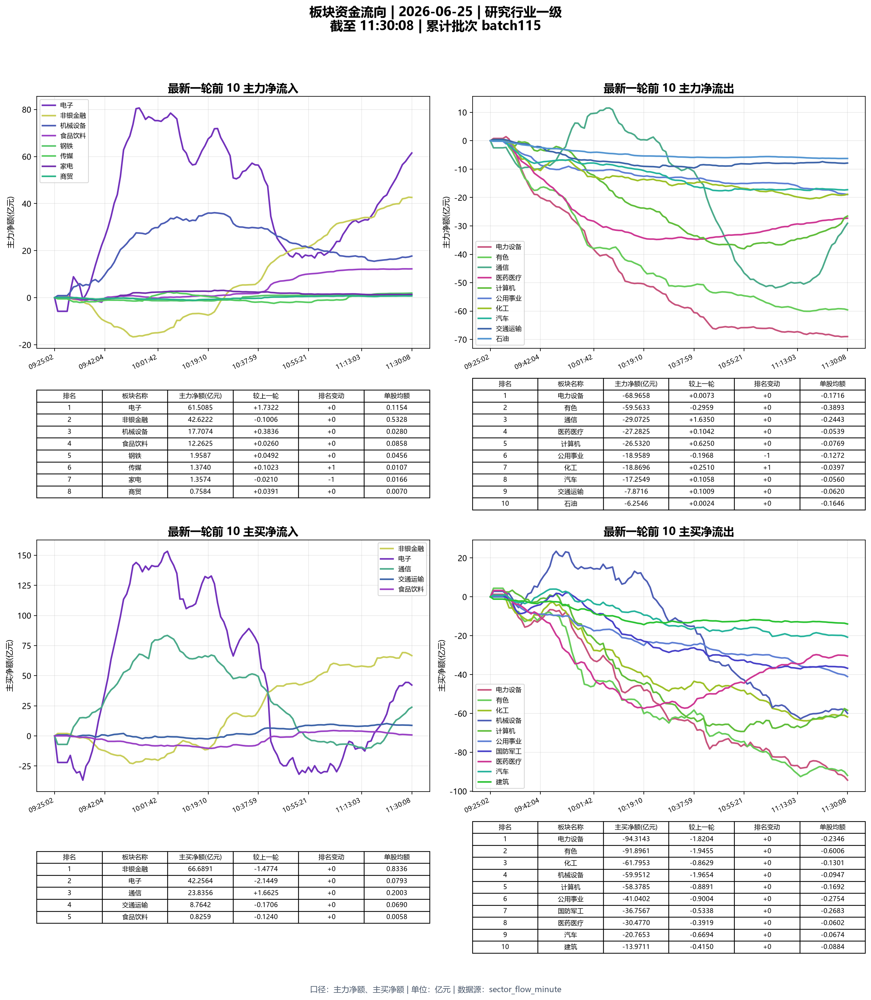

# He-Forge-TDX

> 通达信 TQ Python 基础接口 CLI：行情、资料、公式、路径诊断与可视化示例

<p align="center">
  
  
  
  
</p>

<p align="center">
  <a href="#快速开始">快速开始</a> ·
  <a href="#图表示例">图表示例</a> ·
  <a href="#基础命令分类">命令分类</a> ·
  <a href="#文档索引">文档索引</a> ·
  <a href="#联系方式">联系方式</a>
</p>

基于通达信官方 TdxQuant 基础接口的 Python 命令行仓库，聚焦非交易基础能力、基础诊断与相关共享运行时。

当前公开仓库不展开交易接口、组合模块和持续监控工作流。

> Windows 专属：依赖本地通达信客户端与 `PYPlugins/user/tqcenter.py`，当前不面向 Linux / macOS 原生环境。

## 目录

- [当前范围](#当前范围)
- [能力概览](#能力概览)
- [当前验证状态](#当前验证状态)
- [运行前提](#运行前提)
- [安装](#安装)
- [运行方式](#运行方式)
- [首次配置](#首次配置)
- [快速开始](#快速开始)
- [项目结构](#项目结构)
- [图表示例](#图表示例)
- [联系方式](#联系方式)
- [基础命令分类](#基础命令分类)
- [文档索引](#文档索引)
- [本地文件](#本地文件)

通达信官方 TdxQuant 文档：

- https://help.tdx.com.cn/quant/

## 当前范围

当前覆盖：

- 基础行情接口：快照、K 线、证券列表、板块成分、交易日历
- 基础资料接口：财务、股本、分红、板块关系、扩展字段
- 客户端操作接口：消息、文件、预警、自定义板块
- 公式基础接口：预载、执行、结果读取、批量公式调用
- 路径发现与诊断：通达信目录选择、连通性探针、候选路径排查

当前不包含：

- 交易接口开发
- 组合功能模块与持续监控工作流

## 能力概览

| 类别 | 覆盖内容 |
| --- | --- |
| 行情接口 | 快照、K 线、交易日历、证券列表 |
| 资料接口 | 财务、股本、分红、扩展字段 |
| 板块接口 | 板块列表、板块成分、板块关系 |
| 公式接口 | 指标公式、表达式公式、结果读取 |
| 客户端接口 | 消息推送、订阅管理、自定义板块 |
| 诊断能力 | 路径发现、配置读取、连通性探针 |

## 当前验证状态

- 2026-06-25 已在真实通达信 TQ 客户端环境完成基础接口冒烟验证
- 当前基础命令集已完成一轮真实 TQ 串行验证：共 35 条命令，35 条全部通过
- 详细记录见 [基础接口真实 TQ 冒烟记录](docs/interfaces/BASIC_TQ_SMOKE_2026-06-25.md)
- 单接口测试状态与兼容性说明见 [基础接口测试状态](docs/interfaces/TEST_STATUS.md)

## 运行前提

- Python `>= 3.10`
- Windows 本地环境
- 本机已安装支持 TQ Python 的通达信客户端
- 可访问客户端 `PYPlugins/user/tqcenter.py`
- 客户端已登录，且基础行情接口可正常返回数据

## 安装

```bash
python -m venv .venv
```

Windows:

```bash
.venv\Scripts\activate
python -m pip install -e .
```

安装后也可直接运行：

```bash
tdx --help
```

如果你要验证非 editable 安装，也可以直接安装当前仓库：

```bash
python -m pip install .
```

如果你只想临时运行脚本而不安装 console script，也可以继续使用 `requirements.txt`。

## 运行方式

默认入口：

```bash
python tdx.py <command> [args]
```

已安装 console script 时，也可直接使用：

```bash
tdx <command> [args]
```

现有 `python scripts/<script>.py ...` 用法继续保留，统一入口优先用于基础接口。

## 首次配置

优先走脚本化配置：

```bash
python scripts/setup_tdx_path.py --output table
python scripts/diagnose_tdx_path.py --output json
```

也支持环境变量覆盖：

- `TDX_USER_DIR`: 直接指定 `PYPlugins/user`
- `TDX_ROOT`: 指定通达信安装根目录，脚本会自动补上 `PYPlugins/user`
- `TDX_CONFIG_FILE`: 指定路径配置文件位置
- `TDX_SUBSCRIBE_STATE_FILE`: 指定订阅状态缓存文件位置

## 快速开始

建议按这个顺序验证本地环境：

1. 诊断通达信路径与基础连通性
2. 拉取股票列表确认基础接口可用
3. 获取快照、K 线和交易日历做最小闭环验证

```bash
python tdx.py diagnose-tdx-path --probe stock_list --market 5 --output json
python tdx.py get-stock-list --market 5 --list_type 1 --output json
python tdx.py get-market-snapshot --stock_code 000001.SZ --output json
python tdx.py get-market-data --stock_list 000001.SZ --period 1d --count 5 --output json
python tdx.py get-trading-calendar --market SH --start_time 20260601 --end_time 20260630 --output json
```

## 项目结构

| 目录 | 说明 |
| --- | --- |
| `scripts/` | 对外命令入口与原子接口脚本 |
| `lib/` | 共享逻辑、CLI 适配、路径处理 |
| `docs/` | 接口说明、测试记录与兼容性文档 |
| `tests/` | 自动化测试 |
| `assets/` | README 展示素材 |

## 图表示例

分钟级板块资金流行业看板示例，按研究行业一级汇总，展示盘中主力净额与主买净额两个口径下的流入、流出趋势，以及最新一轮的板块排名结果。

<p align="center">
  
</p>

## 联系方式

如需交流通达信 TQ Python 基础接口、AIGC 应用或相关协作，可通过以下方式联系：

| 渠道 | 账号 |
| --- | --- |
| 微信 | `hlsaigc` |
| Telegram | `@hegenai` |
| 社媒账号 | `@何老师的AIGC` / `@HeGenAI` |

## 基础命令分类

按分类折叠展示，方便在 GitHub 首页快速浏览：

<details>
  <summary><strong>路径配置与诊断</strong></summary>

  <br />

  选择通达信目录：

  ```bash
  python tdx.py setup-tdx-path --output table
  ```

  诊断当前路径与基础连通性：

  ```bash
  python tdx.py diagnose-tdx-path --probe stock_list --market 5 --output json
  ```
</details>

<details>
  <summary><strong>行情快照与 K 线</strong></summary>

  <br />

  实时快照：

  ```bash
  python tdx.py get-market-snapshot --stock_code 000001.SZ --output json
  ```

  K 线数据：

  ```bash
  python tdx.py get-market-data --stock_list 000001.SZ --period 1d --count 5 --output json
  ```

  分时/分笔等周期参数见 [通达信常用参数与枚举](docs/interfaces/PARAMETERS.md)
</details>

<details>
  <summary><strong>交易日与日历</strong></summary>

  <br />

  交易日历：

  ```bash
  python tdx.py get-trading-calendar --market SH --start_time 20260601 --end_time 20260630 --output json
  ```

  交易日列表：

  ```bash
  python tdx.py get-trading-dates --market SH --start_time 20260601 --end_time 20260630 --output json
  ```
</details>

<details>
  <summary><strong>证券列表与板块</strong></summary>

  <br />

  股票列表：

  ```bash
  python tdx.py get-stock-list --market 5 --list_type 1 --output json
  ```

  板块列表：

  ```bash
  python tdx.py get-sector-list --list_type 1 --output json
  ```

  板块成分：

  ```bash
  python tdx.py get-stock-list-in-sector --block_code 881001.SH --output json
  ```

  板块关系：

  ```bash
  python tdx.py get-relation --stock_code 000001.SZ --output json
  ```
</details>

<details>
  <summary><strong>扩展资料</strong></summary>

  <br />

  扩展字段：

  ```bash
  python tdx.py get-more-info --stock_code 000001.SZ --field_list Name Zjl --output json
  ```

  财务数据：

  ```bash
  python tdx.py get-financial-data --stock_list 000001.SZ --field_list FN1 FN8 FN134 --output json
  ```

  指定报告期财务数据：

  ```bash
  python tdx.py get-financial-data-by-date --stock_list 000001.SZ --year 2024 --mmdd 1231 --output json
  ```

  分红送转：

  ```bash
  python tdx.py get-divid-factors --stock_code 000001.SZ --output json
  ```

  股本信息：

  ```bash
  python tdx.py get-gb-info --stock_code 000001.SZ --date_list 20250624 --output json
  ```
</details>

<details>
  <summary><strong>公式基础接口</strong></summary>

  <br />

  指标公式：

  ```bash
  python tdx.py formula-zb --formula_name MACD --formula_arg 12,26,9 --prepare_stock_code 000001.SZ --prepare_stock_period 1d --prepare_count 120 --output json
  ```

  表达式公式：

  ```bash
  python tdx.py formula-exp --formula_name MACD --formula_arg 12,26,9 --prepare_stock_code 000001.SZ --prepare_stock_period 1d --prepare_count 120 --output json
  ```

  读取当前公式数据：

  ```bash
  python tdx.py formula-get-data --formula_kind exp --formula_name MACD --formula_arg 12,26,9 --prepare_stock_code 000001.SZ --prepare_stock_period 1d --prepare_count 120 --output json
  ```
</details>

<details>
  <summary><strong>订阅与客户端操作</strong></summary>

  <br />

  订阅行情：

  ```bash
  python tdx.py subscribe-hq --stock_list 000001.SZ --output json
  ```

  查询订阅列表：

  ```bash
  python tdx.py get-subscribe-hq-stock-list-cached --output json
  ```

  取消订阅：

  ```bash
  python tdx.py unsubscribe-hq --stock_list 000001.SZ --output json
  ```

  发送客户端消息：

  ```bash
  python tdx.py send-message --msg_str "MSG,策略运行中|买入信号数：3" --output json
  ```

  推送自定义板块：

  ```bash
  python tdx.py send-user-block --stocks 000001.SZ --output json
  ```
</details>

## 文档索引

| 文档 | 说明 |
| --- | --- |
| [基础接口文档索引](docs/interfaces/README.md) | 接口文档总入口 |
| [通达信常用参数与枚举](docs/interfaces/PARAMETERS.md) | 常用 market、period 等参数说明 |
| [基础接口测试状态](docs/interfaces/TEST_STATUS.md) | 单接口测试状态与兼容性说明 |
| [脚本命令说明](scripts/README.md) | 脚本入口与常用命令说明 |
| [项目边界与结构规划](ARCHITECTURE.md) | 边界、目录结构与模块约定 |

## 本地文件

| 文件 | 用途 |
| --- | --- |
| `lib/tdx_config.json` | 默认路径配置文件 |
| `lib/tdx_subscribe_state.json` | 默认订阅状态缓存 |

如果不希望本地状态文件写入仓库目录，优先使用 `TDX_CONFIG_FILE` 和 `TDX_SUBSCRIBE_STATE_FILE` 覆盖。

这些本地状态文件以及常见构建产物默认不会进入仓库提交，也不应进入开源分发包。
